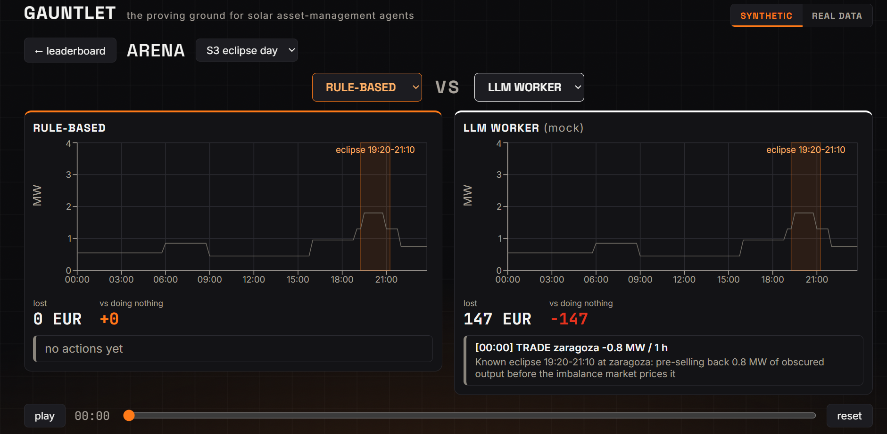
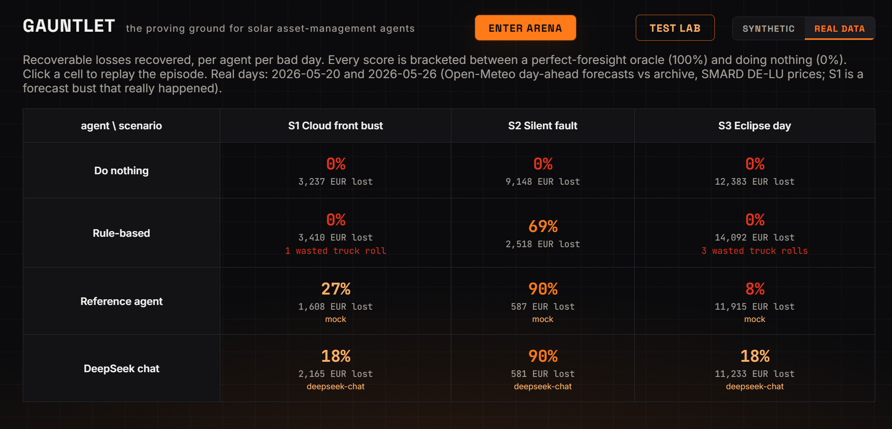

<div align="center">

# 🌑 GAUNTLET

### Run the gauntlet. Bring your agent, see what its bad day costs.

<p>
  
  
  
  
  
  
</p>

A physics-based stress-test gym that throws a power grid's worst days at an autonomous energy agent and scores, in euros, what its decisions cost.

</div>



---

## The problem

Energy companies are wiring autonomous agents into trading, forecasting, and plant operations faster than anyone can prove they are safe. There is no standard way to answer the question that matters most before deployment: when the day goes wrong, does the agent help, or make it worse?

Gauntlet is that answer. It is the proving ground.

## How it works in one breath

1. Pick an agent: a rule-based one, an LLM worker, or your own.
2. Throw it a bad day: a cloud-front forecast bust, a silent inverter fault, or the real 12 August 2026 solar eclipse.
3. Score it from 0 to 100%: the share of *recoverable* losses it actually recovered, bracketed between doing nothing (0%) and a perfect-foresight oracle (100%).
4. Watch the replay, race two agents head to head, and read the euro gap.

> On a 30-day generated battery, a competent LLM worker recovers **55%** (worst-case P10 of 10%) while a hand-tuned rule-based agent manages **8%**. The gym separates the two on purpose.

## Quickstart

```bash
make setup        # venv + pip + npm install (once)
make api          # backend  -> http://localhost:8000   (terminal 1)
make ui           # frontend -> http://localhost:5173   (terminal 2)
# open http://localhost:5173
```

One command for a single-port demo (production build served by the live API):

```bash
make demo         # builds the UI and serves everything at http://localhost:8000
```

Run the gates and build the test batteries:

```bash
make test         # economics, scenarios, drama beats, API
make battery      # discrimination + adversarial batteries
```

No API keys required: the default brain is a deterministic offline mock, and the real-model rows ship as precomputed traces.

## The leaderboard

Every agent, every scenario, scored in euros. Click a cell to replay the episode; toggle SYNTHETIC and REAL data.



## How it works (the longer version)

### The simulator
A deterministic, physics-based portfolio simulator (pvlib) runs a fleet of solar parks (Zaragoza, Valencia, Munich) across a day in 15-minute steps. It tracks the day-ahead forecast, the weather twin (what the real weather allowed), actual production, and the agent's schedule after trades. Same inputs, same outputs, every run.

### The bad days
Three hand-authored scenarios:
- **S1 | cloud-front bust.** A day-ahead forecast that was confidently wrong.
- **S2 | silent fault.** An inverter quietly dies; the only signal is in the data.
- **S3 | eclipse.** The real 12 August 2026 total eclipse dimming Iberian solar into the evening price ramp.

### The score
Every outcome is bracketed by the do-nothing **floor** (0%) and a perfect-foresight **oracle** (100%). An agent's score is the fraction of the recoverable euro loss it actually saved. The unit is money, not forecast accuracy.

### The intelligent generator
Beyond the three scripted days, Gauntlet generates a battery of them. A test case is a genome: weather busts, an optional silent fault, an eclipse overlay, a price regime. A seeded evolutionary search maximizes a fitness that rewards two things at once: recoverable money at stake, and how far the day separates a competent agent from a naive one. A greedy farthest-point pass then spreads the battery across failure modes, so the days are hard and discriminating by construction rather than random jitter.
- **Discrimination mode** is agent-agnostic: find the days that separate good from bad.
- **Adversarial mode** points the same search at one agent and mines the days that break it.

### Tail risk
Each generated day is Monte-Carlo'd. The report is not just the mean; it is the pass-rate and the worst-case **P10**, so a flashy average cannot hide a fragile tail.

### The Arena
Two agents race the same day in real time. Inject chaos live (break an inverter, drop a cloud front) and the day re-simulates instantly for both fighters. You can also play the judge yourself and trade against the machine.

### Real data
A SYNTHETIC / REAL toggle swaps the deterministic world for real days: Open-Meteo day-ahead forecasts versus archived actuals per park, plus SMARD DE-LU day-ahead prices. S1's weather bust is a forecast error that really happened.

### Real brains
The live arena runs the deterministic mock so chaos re-simulates instantly. Real models enter the leaderboard as extra contestants with precomputed traces: DeepSeek personas (Cautious, Balanced, Aggressive) and Claude.

## Architecture

```
        ┌─────────────── frontend (React + Vite + TypeScript) ───────────────┐
        │     Leaderboard  ·  Arena  ·  Test Lab  ·  Replay      (recharts)    │
        └─────────────────────────────────┬───────────────────────────────────┘
                                           │ REST
        ┌─────────────────────────────────┴───────────────────────────────────┐
        │                          FastAPI backend                              │
        │     /results   /episodes   /simulate   /battery   /report             │
        ├───────────────────────────────────────────────────────────────────────┤
        │  sim (pvlib)   scenarios   agents   scoring   oracle                   │
        │  generator:  genome  ->  fitness  ->  evolutionary search  ->  battery │
        │  Monte Carlo (P10)        real-data layer (Open-Meteo / SMARD)         │
        └───────────────────────────────────────────────────────────────────────┘
```

## Tech stack

- **Frontend** React 18, Vite, TypeScript, Recharts, Framer Motion, self-hosted fonts.
- **Backend** FastAPI, Uvicorn, pvlib, NumPy, pandas.
- **Reports** ReportLab and Matplotlib (PDF and CSV certification reports).
- **Data** Open-Meteo (forecasts and actuals), SMARD (DE-LU prices).

## Project layout

```
backend/gauntlet/   sim, scenarios, agents, scoring, generator, api
frontend/src/       React UI (Leaderboard, Arena, Generator, Replay)
traces/             precomputed episodes and batteries (committed)
data/               real-data cache
```

## Commands

| Command | What it does |
|---|---|
| `make setup` | venv + pip + npm install (run once) |
| `make api` / `make ui` | backend on :8000 / frontend dev on :5173 |
| `make demo` | build the UI and serve it plus the API at :8000 |
| `make test` | run the gates: economics, scenarios, drama beats, API |
| `make battery` | build the discrimination and adversarial batteries |
| `make traces` | regenerate the leaderboard traces (mock brain) |
| `make traces-deepseek` | add real DeepSeek rows (needs `DEEPSEEK_API_KEY`) |
| `make fetch-data` | refresh the real Open-Meteo and SMARD data |

## License

MIT. See [LICENSE](LICENSE).
